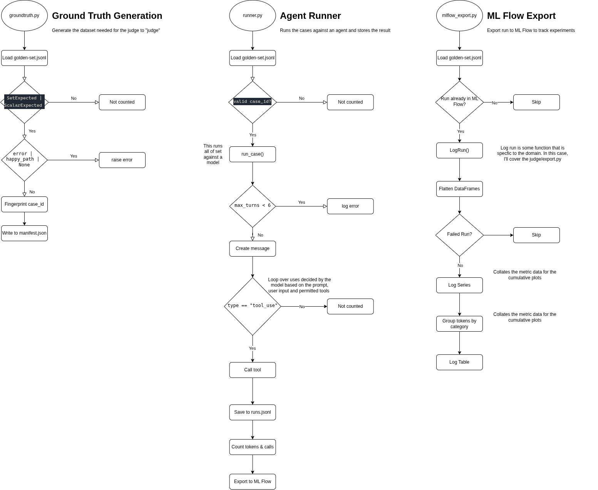

# judge

Does the MCP server help a model answer climbing questions? Cost is measured
separately in [`evals/tokens/`](../tokens/); this is the quality half.

## The pipeline



Three commands:

```
python -m judge.groundtruth          # derive expected values from the local snapshot
python -m judge.groundtruth --check  # verify nothing drifted
python -m judge.runner               # run the set against the model
python -m judge.runner --no-tools    # the baseline the server has to beat
```

The runner exports to MLflow on its own; `python -m judge.export <path>` re-runs
that alone.

## Modules

| | |
| --- | --- |
| `models.py` | The case schema. Import this, not `groundtruth`, if you only need `Case`. |
| `payload.py` | Reading a tool response: what the expected value is, what fingerprints it. |
| `groundtruth.py` | The generate/check CLI. |
| `runner.py` | `AgentRunner`: the agent loop. Records what happened; grades nothing. |
| `grading.py` | The checks, as pure functions over strings and sets. |
| `grade.py` | `Grader`: scores rows against the set. |
| `export.py` | Result rows and grades to MLflow, over `common/mlflow_export.py`. |
| `data/` | The set itself — see [data/README.md](data/README.md). |

## Grading

```
python -m judge.grade        # score runs.jsonl -> grades.jsonl
```

Deterministic only. The judge is next, and per
[docs/plans/judge.md](../../docs/plans/judge.md) the 19 prose cases get hand-labelled
first: a judge with no measured agreement is unfalsifiable.

`set` cases gate on **precision** — every route named must appear in what the tools
actually returned that run. Recall and F1 are logged as diagnostics but do not gate:
a model that lists 19 of 27 routes and hedges is summarising, which is correct for
the question. Precision below 1.0 means a name that came from somewhere else.

Precision only sees names the case or the tools know about, so a wholly invented
route is invisible to it; the judge covers that on prose cases.

The three tiers, from [design.md](../docs/design.md), in order of preference:

| `expected.kind` | Graded by | Cases |
| --- | --- | --- |
| `scalar` | Exact match | 2 |
| `set` | Set F1, precision and recall reported separately | 6 |
| `prose` | Judge, on groundedness | 19 |

Precision and recall stay separate because they are different bugs: dropping
routes is a recall failure, inventing them a precision failure, and averaging
hides which is happening.

The judge sees the question, the tool output the model had, and the answer — not
the expected value. It checks entailment against the context, not correctness
against the world.

## Running it

Needs the local stack (`scripts/dev-up.sh`) and, for `runner.py` only, an
`ANTHROPIC_API_KEY`. See [`.template.env`](../../.template.env). Settings live in
[`common/config.py`](../common/config.py).
